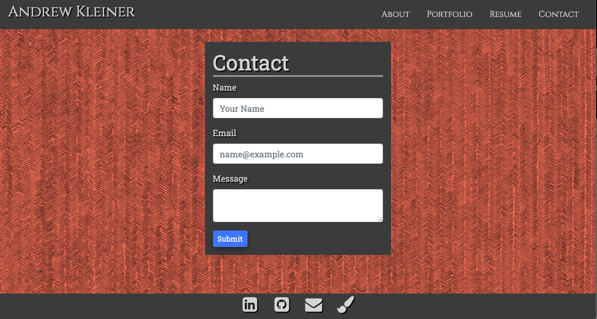

# Andrew Kleiner Portfolio

## About:
In order to increase marketability and scope, it is important for every person working in a creative field to display their work with an online presence. I created this site to showcase the work I have done as a web developer, with the hopes to eventually implement my work as a lighting designer as well. 

The main technology used to create this site was ReactJS. Utilizing its state, and virtual DOM features, I was able to create a dynamic site for the user with as minimal code as possible. Components were used for each route, rendering the home, portfolio, and contact pages. State was used, along with nodemailer, and react-notify-toast in order to create a dynamic and practical contact form. Map functions using props were used to create the portfolio cards. 

This site note only showcases my growth as a developer in its own code, but also with the progress tracked in my portfolio page.

## Index
1) [About](#About)
1) [Installation](#Installation)
2) [Usage](#Usage)
3) [Contributors](#Contributors)
4) [GitHub](#GitHub)
5) [Screeshots](#Screenshots)

## Installation:
run npm install both in the root, and in the client folder

## Usage:
Visit the deployed site at https://andrew-kleiner.herokuapp.com/

## Contributors:
Andrew Kleiner

Background Art: Matt Greer

## GitHub Username:
akleiner26

## GitHub Repo:
https://github.com/akleiner26

## GitHub Photo:
 

## GitHub Email:
AndrewJKleiner@gmail.com

## ScreenShots

### Homepage

### Portfolio

### Resume

### Contact

### Email Submitted
